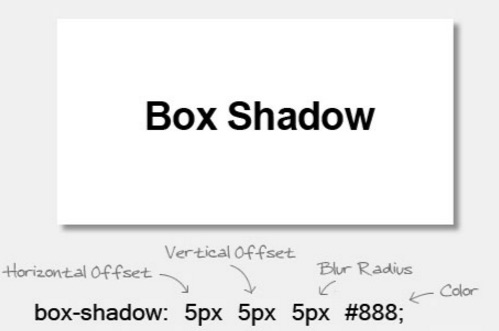

## Урок 10

### Задача за домашна работа

Направете страница, която:
  
1. има бутон **Contact me**, който при натискане да показва диалог с контактната форма от домашно 9
2. има поне 2 от следните Bootstrap.js компонента:
   - accordion
   - tabs
   - modal
   - scrollspy
   - accordion
   - affix

_Съвет: ако правите **modal**-а сами, можете да ползвате **box-shadow** CSS poperty-то, за да постигете 3D ефект._
  

Приятна работа! 

